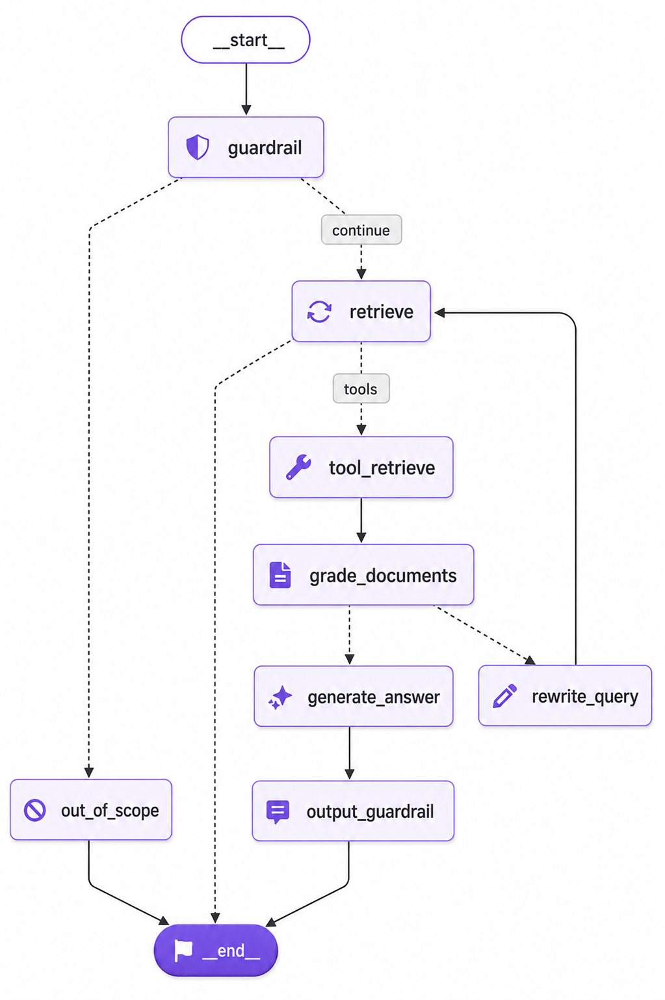
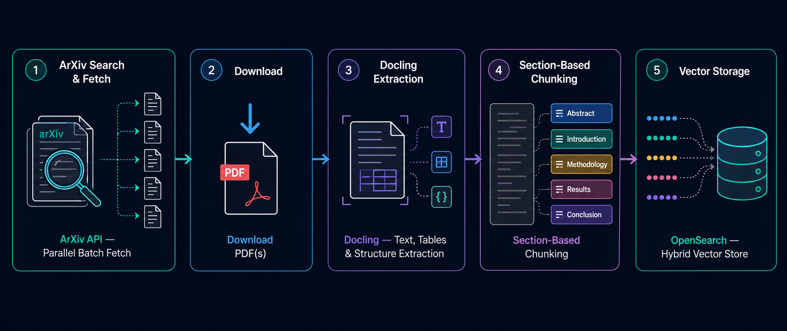

# ArXiv Copilot — Agentic Research Assistant

> An end-to-end **RAG-based agentic system** that helps researchers fetch, search, retrieve, and reason over ArXiv papers — with full observability, hybrid retrieval, and LLM-based guardrails baked in.

**Status:** 🚧 In Progress — core pipeline functional, actively adding features and hardening guardrails.

---

## Overview

ArXiv Copilot is an agentic research assistant built to help users search, extract, and query academic papers from ArXiv. It combines document parsing, hybrid vector search, and an LLM-orchestrated agent flow, with observability and safety layered in at every stage — from raw user input to final LLM output.

---

## Architecture



*High-level agentic flow — request → guardrails → retrieval → reasoning/tools → response.*

---

## Key Features

### 🧠 Agentic Flow
- Full agentic orchestration handling query understanding, tool/routing decisions, retrieval, and response synthesis.
- Modular graph-based flow (see `assets/graph.png`) so nodes/steps can be added, removed, or reordered independently.

### 📥 ArXiv Paper Fetching & Ingestion Pipeline



- Direct integration with **ArXiv** to fetch research papers straight from the source (no manual upload needed).
- **Parallel batch fetching** — supports pulling and **downloading multiple papers concurrently**, speeding up ingestion when indexing large sets of papers at once.
- Each fetched paper is then run through the full ingestion pipeline automatically:
  1. **Download** the paper (PDF) from ArXiv.
  2. **Extract** content using Docling (text, tables, structure).
  3. **Chunk** the extracted content into **section-based chunks** (Abstract, Introduction, Methodology, Results, Conclusion, etc.).
  4. **Embed & store** the chunks in **OpenSearch** (vector DB), making them immediately available for retrieval.
- **Query-based paper search** — users can simply type a natural language query, and the agent searches ArXiv, fetches the most relevant paper(s), runs them through the pipeline above, and returns a **generated summary** — no need to manually locate or download the paper first.
- This is a **fully RAG-based project** — all question-answering and summarization is grounded in retrieved, indexed paper sections rather than relying on the LLM's parametric knowledge alone.

### 📄 Paper Extraction & Indexing
- **Docling** used for robust extraction of text, tables, and structure from ArXiv PDFs.
- **Section-based indexing** — papers are chunked and indexed by logical sections (Abstract, Introduction, Methodology, Results, Conclusion, etc.) rather than naive fixed-size chunking, improving retrieval precision and context relevance.

### 🔍 Hybrid Vector Search
- **OpenSearch** as the vector database.
- Hybrid search combining dense vector similarity with traditional keyword/BM25 search for more robust retrieval across both semantic and lexical matches.

### 🛡️ Guardrails (Multi-Layer)
A layered defense pipeline applied to inputs (and outputs) before/after they reach the core LLM:
1. **Rate limiting** — protects against abuse and runaway usage.
2. **Regex-based classifier** — fast, deterministic first-pass filtering for known bad patterns (PII, prompt injection markers, disallowed content, etc.).
3. **LLM-as-a-judge classifier layer** — a secondary LLM call that semantically evaluates inputs/outputs for policy violations that regex alone can't catch.

This layered approach balances speed (regex) with semantic understanding (LLM judge) to reduce both false negatives and latency overhead.

### 🔗 LLM Gateway
- **LiteLLM** used as a unified gateway/proxy layer for all LLM calls — enabling provider-agnostic routing, fallback handling, and centralized API key/config management across multiple model providers.

### 📊 Observability
Two dedicated observability layers, separating application-level and model-level concerns:
- **Logfire** — application-level observability (request traces, latency, errors, system health across the full agentic pipeline).
- **Langfuse** — LLM-specific observability (prompt/response tracing, token usage, cost tracking, evaluation, and debugging of individual LLM calls within the agent flow).

---

## Tech Stack

| Component               | Technology     |
|--------------------------|----------------|
| Agent Orchestration       | Custom agentic graph flow |
| Document Parsing          | Docling |
| Vector Database           | OpenSearch (hybrid search) |
| LLM Gateway               | LiteLLM |
| App Observability         | Logfire |
| LLM Observability         | Langfuse |
| Guardrails                | Rate limiting + Regex classifier + LLM-as-guardrail |

---

## Project Structure

```
arxiv-copilot/
├── assets/
│   └── graph.png            # Agentic flow diagram
├── src/
│   ├── db/                  # Database connections / clients (Postgres, etc.)
│   ├── models/              # ORM / data models
│   ├── repositories/        # Data access layer (repository pattern)
│   ├── route/               # API route definitions
│   ├── schemas/             # Pydantic request/response schemas for services
│   ├── services/            # Core business logic (agent flow, retrieval, opensearch,LLM gateway  
│   │                        #   extraction, guardrails, gateway, observability)
│   ├── config.py            # App configuration / settings
│   ├── dependencies.py      # Shared dependency-injection providers
│   ├── exceptions.py        # Custom exception classes
│   └── main.py              # Application entry point
├── tests/
└── README.md

```

---

## How It Works (High Level)

1. **User query** comes in through the app entry point — either as a direct question (RAG-style, retrieving from already-indexed papers) or as a paper search/fetch request.
2. **If fetching new papers**: the agent searches ArXiv (single or parallel batch), downloads the PDF(s), extracts content via Docling, splits it into section-based chunks, embeds them, and stores them in OpenSearch — making the paper(s) immediately retrievable.
3. **Guardrail layer** validates the input:
   - Rate limit check
   - Regex classifier scan
   - LLM classifier judgment (if needed)
4. **Retrieval**: relevant paper sections are fetched from OpenSearch using hybrid (dense + keyword) search.
5. **Agent reasoning**: the agent (routed via LiteLLM) synthesizes retrieved context, may invoke tools, and generates a response — e.g. a direct answer, or a paper summary.
6. **Output guardrails** (where applicable) validate the response before returning it to the user.
7. Every step is traced — application-level via **Logfire**, LLM-level via **Langfuse**.

---

## Setup

> ⚠️ Setup instructions are still being finalized as the project is in progress. Update this section with actual install/run steps once stabilized.

```bash
# Clone the repo
git clone <repo-url>
cd arxiv-copilot

# Install dependencies
pip install -r requirements.txt

# Configure environment variables
cp .env.example .env
# Fill in: OPENSEARCH_HOST, LITELLM_CONFIG, LOGFIRE_TOKEN, LANGFUSE_PUBLIC_KEY, LANGFUSE_SECRET_KEY, etc.

# Run the application
python main.py
```

---

## Roadmap / TODO

- [ ] Finalize output-side guardrails (not just input-side)
- [ ] Expand evaluation suite for retrieval quality (section-based indexing)
- [ ] Add caching layer for repeated queries
- [ ] Add automated regression tests for guardrail classifiers
- [ ] Document LiteLLM routing/fallback configuration
- [ ] Add deployment guide (Docker/K8s)
- [ ] Expand Langfuse dashboards for cost/latency tracking per agent node

---

## Contributing

This project is under active development. Issues, suggestions, and PRs are welcome — please open an issue to discuss significant changes before submitting a PR.

---

## License

_Add your license here (e.g., MIT, Apache 2.0)._